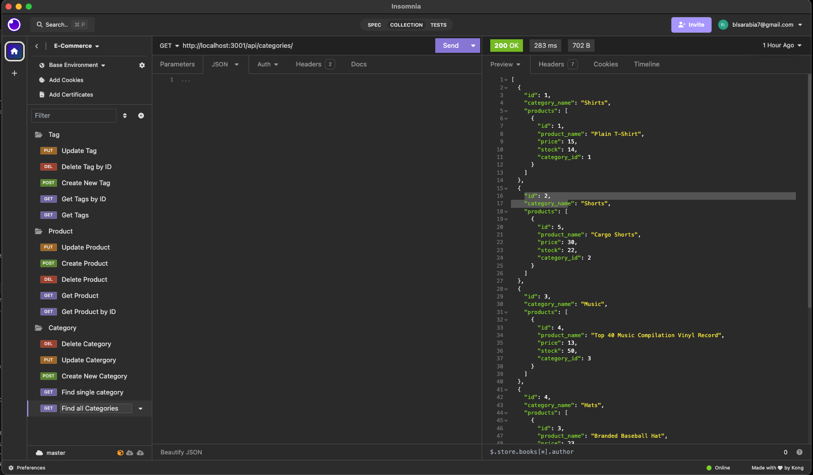

# E-Commerce-Backend

## Name
E-Commerce-Backend

## Description
This Challenge is to build the back end for an e-commerce site by configuring a working Express.js API to use Sequelize to interact with a MySql database.

## Visuals

GitHub Repo Link: https://github.com/brendaleea/E-Commerce-Backend

Video Link : https://drive.google.com/file/d/1kiPbBS7Kx0NAV3qLsjfL-eQiWnVD21_J/view

## Installation
This project was created using JS,Express.js API, Inquirer, and MySQL

## Install instructions & Steps
1. npm i
2. mysql -u root -p
3. source db/schema.sql
4. exit
5. npm run seed
6. npm start

## Support
If you have any questions please feel free to contact me via slack 